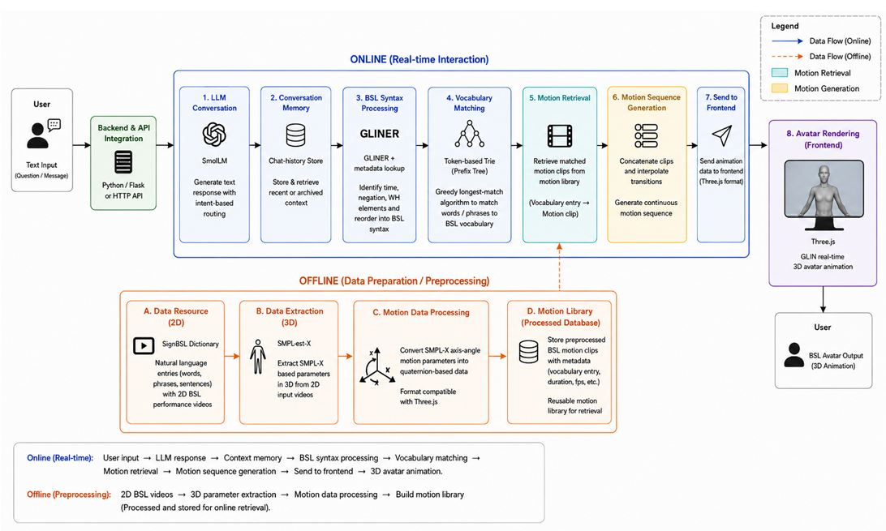

# BSL Avatar Prototype

This project develops a prototype of a 3D virtual human that communicates using British Sign Language (BSL). The system includes a JavaScript frontend and a Python backend, with SmolLM integrated to support multi-turn conversations. After a user enters text, the model generates a response, which is matched against the available BSL vocabulary and converted into BSL-style syntax. The corresponding sign motions are then concatenated and interpolated to create a complete animation sequence, which drives the 3D virtual human on the frontend. 

## 1 Environment Setup
Our environment is based on conda
1. Clone the project from git
2. `cd` to the project root
3. Run env_setup.sh as:  
    ```
    chmod +x env_setup.sh
    ./env_setup.sh
    ```

## 2 Program Run
It is recommended to use Chrome as default web browser, since this is a prototype and we have not applied browser adaption. 
1. To run the program, `cd` to the project root
2. Activate the enviroment: `conda activate signavatar`
3. Run: `python app.py`

The first run could be slow, since pretrained models need to be downloaded and the virtual character models need to be cached to frontend.


## 3 Project Data Flow
  


## 4 Dataset Collection
We collect the data from https://www.signbsl.com/sign/dictionary.


## 5 Data Preparation
1. To cleanup the raw data collected from online, follow the steps documented in `./vocab_preprocess/readme.md`. This is for cleaning on textual contents only.  

2. To infer smplx parameters, particularly we care about axis-angle here, setup SMPLest-X based on its official repo: https://github.com/MotrixLab/SMPLest-X.  
The batch inference script is under `./batch_infer_smpl/batch_inference.py`.  
For each video, the smplx parameters are stored in a .npz.  

3. We need to convert the axis-angle rotation to quaternion rotations (in .npz) that are compatible with the js frontend (mixamo style) (stored in JSON).  
The batch conversion file is under `./preprocess/batch_axisangle_npz_to_threejs_json.py`

